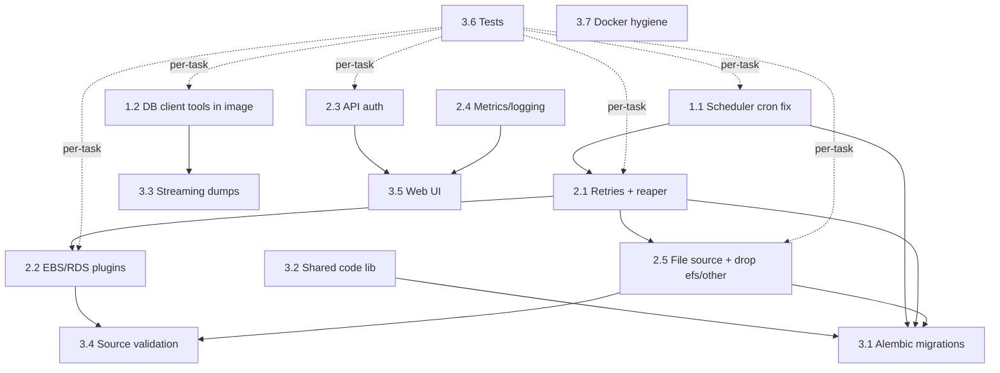

# Backup Orchestrator — Completion Plan

Status assessment date: 2026-07-31

This plan covers everything required to bring the project to a production-ready state,
ordered by priority. Low-priority polish items (HA/clustering, notifications, CI/CD,
vault integration, pagination) are intentionally excluded.

---

## Phase 1 — Critical (blocks correct operation)

### 1.1 Fix the scheduler cron bug

**Problem:** `apps/worker/scheduler.py` ignores the `schedule_cron` field entirely.
It polls the DB every 60 seconds and enqueues **every** active binding on every tick.
A binding scheduled for `0 2 * * *` (daily at 02:00) currently gets ~1,440 runs/day.

**Files:** `apps/worker/scheduler.py`, `apps/worker/pyproject.toml`, `apps/worker/models.py`, `apps/api/app/models.py`

**Implementation steps:**

1. Add `croniter` to `apps/worker/pyproject.toml` dependencies.
2. Add a `last_scheduled_at` (nullable `DateTime(timezone=True)`) column to the
   `Binding` model (both copies until Phase 3 dedup lands; see task 3.2).
3. In the scheduler loop, for each active binding:
   - Skip if `schedule_cron` is null/empty (manual-trigger-only bindings).
   - Compute the next fire time with
     `croniter(binding.schedule_cron, binding.last_scheduled_at or created_at).get_next(datetime)`.
   - Enqueue only if `next_fire <= now (UTC)`.
   - Update `last_scheduled_at = now` in the same transaction as the run insert so a
     crash between insert and update can't double-fire.
4. Validate cron expressions at write time in the API (`POST/PUT /bindings`):
   reject invalid expressions with a 422 using `croniter.is_valid()` (add `croniter`
   to `apps/api/pyproject.toml` too).
5. Deduplication guard: before enqueueing, check there is no existing `BackupRun`
   for the binding in `queued` or `running` status; skip and log if there is.
   This also protects against scheduler restarts.
6. Make the poll interval configurable: `SCHEDULER_INTERVAL_SECONDS` env var,
   default 60. Add to `.env.example` and `docker-compose.yml`.
7. All datetime handling in UTC (`datetime.now(timezone.utc)`); document that cron
   expressions are evaluated in UTC.

**Acceptance criteria:**
- A binding with `0 2 * * *` produces exactly one run per day.
- Invalid cron strings are rejected by the API with a clear error message.
- Restarting the scheduler does not create duplicate queued runs.
- Unit tests cover: due/not-due evaluation, null cron skip, dedup guard, invalid cron rejection.

---

### 1.2 Install database client tools in the worker image

**Problem:** `apps/worker/plugins/db_to_s3.py` shells out to `pg_dump` and
`mysqldump`, but `apps/worker/Dockerfile` never installs them — every database
backup fails inside the container.

**Files:** `apps/worker/Dockerfile`

**Implementation steps:**

1. Add to the worker Dockerfile (Debian slim base):
   ```dockerfile
   RUN apt-get update \
       && apt-get install -y --no-install-recommends \
          postgresql-client \
          default-mysql-client \
       && rm -rf /var/lib/apt/lists/*
   ```
2. Verify the installed `pg_dump` major version is compatible with the PostgreSQL
   server version in `docker-compose.yml`; if not, use the PGDG apt repo to pin a
   matching client version.
3. Add a startup sanity check (or at minimum a log line) in the worker that
   verifies `pg_dump --version` and `mysqldump --version` resolve, so a missing
   binary is caught at boot rather than at first job.

**Acceptance criteria:**
- `docker compose run worker pg_dump --version` and `mysqldump --version` succeed.
- An end-to-end `postgres → S3(MinIO)` backup run completes via docker-compose.

---

## Phase 2 — High priority (core functionality gaps)

### 2.1 Job retry logic and stale-run recovery

**Problem:** Jobs fail permanently on the first error (`apps/worker/tasks.py`).
Transient S3/network/DB errors are not retried. If a worker process dies mid-job,
the run stays in `running` forever.

**Files:** `apps/worker/tasks.py`, `apps/worker/scheduler.py` (or a new reaper),
`apps/api/app/main.py` (enqueue calls), `.env.example`, `docker-compose.yml`

**Implementation steps:**

1. **RQ-level retries:** enqueue jobs with
   `Retry(max=MAX_RETRIES, interval=[60, 300, 900])` (exponential backoff).
   Make `MAX_RETRIES` an env var (default 3). Update both enqueue sites
   (API `/runs/trigger/{binding_id}` and the scheduler).
2. **Run-state semantics for retries:** on a retryable failure, set the run status
   back to `queued` (or add a `retrying` status) and record the attempt count on
   `BackupRun` (`attempts: int`, `max_attempts: int` columns). Only mark `failed`
   after the final attempt.
3. **Distinguish retryable vs. fatal errors:** retry on `botocore` transient errors
   (throttling, timeouts, 5xx), connection errors, and dump-tool non-zero exits
   caused by connectivity; do NOT retry on `NotImplementedError`, validation
   errors, or auth failures (4xx from S3).
4. **Job timeout:** pass `job_timeout` from env (`RQ_JOB_TIMEOUT`, default e.g.
   `2h`) when enqueueing so hung jobs are killed by RQ instead of blocking the
   queue indefinitely.
5. **Stale-run reaper:** add a small loop (can live in the scheduler process) that
   marks runs as `failed` (message: "worker lost / timed out") when they have been
   `running` longer than `RQ_JOB_TIMEOUT + grace` with no corresponding live RQ job.
6. Stop truncating error messages at 500 chars, or raise the column size
   (`Text` instead of `String(500)`) so root causes aren't lost.

**Acceptance criteria:**
- A job that fails with a simulated transient S3 error succeeds on a later attempt.
- A job that fails with a fatal error is marked `failed` immediately, no retries.
- Killing the worker mid-job results in the run being marked `failed` by the reaper
  within the timeout window.
- Tests cover retry classification, attempt counting, and reaper behavior.

---

### 2.2 Implement EBS / RDS source types

**Problem:** `apps/worker/tasks.py` raises
`NotImplementedError("Source type '...' is not implemented yet")` for EBS and
RDS. The legacy handlers (`legacy/src/handlers/ebs.py`, `rds.py`) were
never ported — and were themselves partially stubbed.
(EFS is being dropped instead of implemented — see task 2.5.)

**Files:** new plugins under `apps/worker/plugins/` (`ebs_snapshot.py`,
`rds_snapshot.py`), `apps/worker/tasks.py` (dispatch),
`apps/api/app/main.py` (validation endpoints), `apps/api/app/schemas.py`,
`apps/worker/pyproject.toml` (boto3 already present — verify)

**Design decision (make explicit before coding):** these are *snapshot-based*
backups, not byte-copy backups. The plugin contract should therefore return
snapshot/recovery-point identifiers rather than uploaded byte counts.

**Implementation steps per source type:**

- **EBS (`ebs_snapshot.py`):**
  1. Settings schema: `volume_id`, `region`, optional `kms_key_id`, tag map.
  2. Call `ec2.create_snapshot(VolumeId=..., Description=..., TagSpecifications=...)`.
  3. Poll `describe_snapshots` until `completed` (with timeout + backoff).
  4. Optional cross-region/account copy via `copy_snapshot` when the destination
     specifies a different region.
  5. Retention: prune snapshots older than `retention_days` matching the
     orchestrator's tag.
  6. Port the AZ-resolution TODO from `legacy/src/handlers/ebs.py:131` properly:
     resolve the volume's AZ/region dynamically via `describe_volumes` instead of
     hardcoding.

- **RDS (`rds_snapshot.py`):**
  1. Settings schema: `db_instance_identifier` (or `db_cluster_identifier` for
     Aurora), `region`, optional `kms_key_id`.
  2. Call `rds.create_db_snapshot` / `create_db_cluster_snapshot`.
  3. Wait for `available` status with backoff.
  4. Optional `copy_db_snapshot` to another region for DR.
  5. Retention pruning by tag + age.
  6. Do NOT port `legacy/src/handlers/rds.py:150` `copy_to_destination`
     NotImplementedError — export-to-S3 (`start_export_task`) can be a follow-up;
     document it as out of scope for the first pass.

**Common wiring:**
1. Extend the dispatch table in `apps/worker/tasks.py` to route both source
   types to their plugins.
2. Add `bytes_transferred`-equivalent metadata: store `artifact_ref` (snapshot ID /
   recovery point ARN) on `BackupRun` (new nullable string column).
3. Implement API validation for each type (`/validate/source/{id}`):
   `describe_volumes` / `describe_db_instances` to verify
   existence and permissions.
4. Credentials come through the existing `secret_resolver` pattern (AWS access key
   pair or ambient IAM role when keys are absent).
5. Update `docs/api-usage.md` with settings examples for each new source type.

**Acceptance criteria:**
- Creating a binding for each type and triggering a run produces a real snapshot
  (verified against moto or localstack in tests).
- Validation endpoints return structured pass/fail for both types.
- Unsupported combinations (e.g., EBS source → non-AWS destination) are rejected at
  binding validation time with a clear message.
- Unit tests using `moto` cover the happy path and permission-denied path per type.

---

### 2.3 API authentication

**Problem:** The API has no authentication whatsoever. Anyone who can reach port
8000 can read/write all backup configs (which include credential references) and
trigger/cancel runs.

**Files:** `apps/api/app/main.py`, new `apps/api/app/auth.py`,
`apps/api/app/config.py`, `apps/web/app.js`, `.env.example`, `docker-compose.yml`,
`tests/`

**Implementation steps:**

1. **Scheme:** static API-key auth as the baseline (simplest thing that closes the
   hole; JWT/OAuth can layer on later):
   - `API_KEYS` env var — comma-separated list of accepted keys.
   - FastAPI dependency (`Security(APIKeyHeader(name="X-API-Key"))`) applied to
     the whole router except `/health` and `/docs` (docs behind a flag:
     `EXPOSE_DOCS`, default true in dev).
   - Constant-time comparison (`secrets.compare_digest`) against each configured key.
2. Return `401` with `WWW-Authenticate` header on missing/invalid key.
3. **Web UI:** add an API-key field persisted in `localStorage`; attach
   `X-API-Key` header to every fetch in `apps/web/app.js`. Show a login-ish prompt
   when a request returns 401.
4. **CORS hardening:** keep `CORS_ORIGINS` but stop defaulting to `*` anywhere;
   document that production deployments must set it explicitly.
5. Basic rate limiting on auth failures (e.g., `slowapi` limiter on 401 responses)
   — keep minimal; a reverse proxy can do the rest.
6. Update `docs/api-usage.md` and `docs/getting-started.md` with auth setup and
   curl examples including the header.

**Acceptance criteria:**
- All endpoints except `/health` return 401 without a valid `X-API-Key`.
- Web UI works end-to-end after entering the key once.
- Tests: valid key passes, invalid key 401s, `/health` stays open, timing-safe
  comparison is used.

---

### 2.4 Port Prometheus metrics / observability

**Problem:** The legacy system exposed Prometheus metrics
(`legacy/src/metrics.py`: operation counters, failure counters, uploaded bytes,
last-success timestamps, duration histograms, destination availability). The new
system has zero metrics and near-zero logging.

**Files:** new `apps/worker/metrics.py`, `apps/api/app/main.py`,
`apps/worker/tasks.py`, `apps/worker/scheduler.py`, both `pyproject.toml`s,
`docker-compose.yml`, `.env.example`

**Implementation steps:**

1. Add `prometheus-client` to API and worker dependencies.
2. **API metrics:** mount `prometheus_fastapi_instrumentator` (or hand-rolled
   middleware) exposing `/metrics` — request counts, latencies, status codes.
3. **Worker metrics** (port names from legacy for dashboard continuity):
   - `backup_operations_total{source_type, status}` (Counter)
   - `backup_failures_total{source_type, error_class}` (Counter)
   - `backup_uploaded_bytes_total{binding}` (Counter)
   - `backup_last_success_timestamp{binding}` (Gauge)
   - `backup_operation_duration_seconds{source_type}` (Histogram)
   - `scheduler_enqueued_runs_total` (Counter)
   Expose via `prometheus_client.start_http_server(METRICS_PORT)` in the worker
   and scheduler processes (default port 9090; env-configurable). Note: with
   multiple RQ worker processes, either run one worker per container (current
   setup — fine) or use `multiprocess` mode.
4. **Structured logging:** replace ad-hoc prints/basicConfig with `logging`
   configured from a `LOG_LEVEL` env var; JSON formatter optional but log at
   minimum: job start/finish with run_id + binding_id + duration + outcome,
   scheduler enqueue decisions, API errors.
5. Expose the metrics ports in `docker-compose.yml` and add a commented-out
   Prometheus + Grafana service block (or document scrape config in docs) —
   full monitoring stack provisioning stays out of scope.

**Acceptance criteria:**
- `curl :8000/metrics` (API) and `curl :9090/metrics` (worker) return Prometheus
  text format.
- Running a backup increments `backup_operations_total` and observes a duration.
- A failed backup increments `backup_failures_total`.
- `LOG_LEVEL=DEBUG` visibly changes verbosity in all three services.

---

### 2.5 Implement File source type; remove EFS and `other` source types

**Problem:** The `SourceType` enum (`apps/api/app/models.py` /
`apps/worker/models.py`) contains `efs` and `other`, neither of which will ever be
implemented (`other` has no meaning; EFS is deliberately dropped — mounted
filesystems are covered by the new File source instead). Meanwhile there is no way
to back up a plain directory tree (local path or mounted volume: NFS, EFS mount,
bind mount) to S3 — a core backup use case.

**Files:** new plugin `apps/worker/plugins/file_to_s3.py`,
`apps/api/app/models.py` + `apps/worker/models.py` (or `libs/orchestrator_core/`
after task 3.2), `apps/worker/tasks.py` (dispatch),
`apps/api/app/main.py` (validation), `apps/api/app/schemas.py`,
`apps/web/index.html` + `apps/web/app.js` (source-type dropdown),
`docker-compose.yml` (worker volume mounts), `docs/api-usage.md`,
Alembic migration (task 3.1)

**Implementation steps:**

1. **Enum changes:** add `file = "file"`; remove `efs` and `other` from
   `SourceType` in both model copies (single copy once 3.2 lands).
2. **Data migration:** Alembic migration that (a) fails loudly if any existing
   `sources` rows use `efs`/`other` (require the operator to delete or convert them
   first — do not silently drop data), then (b) alters the Postgres enum type:
   add `file`, remove `efs`/`other` (enum value removal in Postgres requires a
   type-swap: create new type → alter column → drop old type).
3. **Settings schema for File sources:**
   - `root_path` (absolute path inside the worker container),
   - `include_globs` / `exclude_globs` (optional lists),
   - `follow_symlinks` (bool, default false),
   - `key_prefix` (S3 destination prefix, default `file/{source_name}/`).
4. **Plugin (`file_to_s3.py`):**
   - Walk `root_path` with `os.walk` (respecting glob filters and symlink policy).
   - Upload each file via `upload_file` with the destination's SSE `ExtraArgs`
     (reuse the encryption handling from `s3_to_s3.py`).
   - Incremental: skip objects whose S3 size + mtime-derived metadata
     (`x-amz-meta-mtime`) match the local file, mirroring the s3_to_s3 dedup
     approach.
   - Preserve relative paths as S3 keys under `key_prefix`.
   - Accumulate `bytes_transferred` / files-copied / files-skipped counts on the
     run.
   - Guardrails: reject `root_path` outside an allow-list env var
     (`FILE_SOURCE_ALLOWED_ROOTS`, colon-separated, e.g. `/data:/mnt/backups`) so
     an API user can't exfiltrate arbitrary container paths (e.g. `/etc`,
     `/run/secrets`). Resolve the path (`Path.resolve()`) before checking to
     defeat `..` traversal.
5. **Worker wiring:** add `file` to the dispatch table in `tasks.py`; mount the
   host directories to back up into the worker container via `docker-compose.yml`
   volumes (document the pattern; ship a commented example).
6. **API validation (`/validate/source/{id}`):** checks — path is inside the
   allow-list, exists, is a directory, is readable; return structured
   `checks: [{name, passed, detail}]` like the other validators. Note: validation
   runs in the API container, which may not share mounts with the worker — either
   mount the same volumes into the API, or have validation only verify
   settings-shape + allow-list and defer existence checks to a dry-run job
   (choose and document one; the volume-sharing option is simpler).
7. **Cleanup of removed types:** delete every `efs`/`other` branch — worker
   dispatch/`NotImplementedError` cases, API validation stubs, Pydantic schema
   literals, and web UI dropdown options. Add `file` to the web UI dropdown with
   its settings fields.
8. Update `docs/api-usage.md`: File source example (settings JSON + compose volume
   snippet); remove any EFS/`other` mentions.

**Acceptance criteria:**
- A File source pointed at a mounted directory backs up to MinIO end-to-end via
  docker-compose; re-running skips unchanged files.
- `root_path` outside `FILE_SOURCE_ALLOWED_ROOTS` (including `..` tricks) is
  rejected at validation and again at job execution.
- Creating a source with type `efs` or `other` is rejected by the API (422).
- `grep -ri "efs\|'other'" apps/` shows no remaining source-type references.
- Tests cover: walk + glob filtering, incremental skip, allow-list enforcement,
  encryption ExtraArgs propagation, migration failure on existing `efs`/`other`
  rows.

---

## Phase 3 — Medium priority (robustness & maintainability)

### 3.1 Database migrations with Alembic

**Problem:** Schema is created via `Base.metadata.create_all()` at API startup
(`apps/api/app/main.py`). No versioning, no way to evolve the schema (Phases 1–2
add columns: `last_scheduled_at`, `attempts`, `artifact_ref`; task 2.5 alters the
`SourceType` enum), and concurrent API replicas can race on DDL.

**Files:** new `apps/api/alembic/` + `alembic.ini`, `apps/api/app/main.py`,
`apps/api/Dockerfile` or `docker-compose.yml` (migration step)

**Implementation steps:**

1. `alembic init` inside `apps/api`; point `env.py` at the existing `Base` metadata
   and `DATABASE_URL` from settings.
2. Generate the initial migration from current models
   (`alembic revision --autogenerate -m "initial schema"`); verify against a
   fresh DB.
3. Add follow-up migrations for the new columns from Phases 1–2 and the
   `SourceType` enum change from task 2.5 (add `file`, drop `efs`/`other`).
4. Remove `create_all()` from app startup. Run migrations as a dedicated step:
   `command: alembic upgrade head` as a docker-compose one-shot service that api/
   worker `depends_on` with `condition: service_completed_successfully` — or as a
   Dockerfile entrypoint pre-step. Prefer the compose one-shot to avoid replica
   races.
5. Document the migration workflow in `docs/getting-started.md`
   (create revision → review → upgrade).

**Acceptance criteria:**
- Fresh `docker compose up` bootstraps the schema through Alembic only.
- `alembic upgrade head` is idempotent on an already-migrated DB.
- `create_all` no longer exists in app code (tests may still use it against
  SQLite for speed — acceptable, note it in the test file).

---

### 3.2 De-duplicate shared code (models, secret resolver)

**Problem:** `apps/api/app/models.py` ≡ `apps/worker/models.py` and
`apps/api/app/secret_resolver.py` ≡ `apps/worker/secret_resolver.py` are identical
copies. Every schema change must be made twice; drift is inevitable (and Phases 1–2
add columns).

**Files:** new `libs/orchestrator_core/` package; both `pyproject.toml`s;
both Dockerfiles; deletion of the duplicated modules

**Implementation steps:**

1. Create `libs/orchestrator_core/` with `pyproject.toml`
   (name: `orchestrator-core`) containing:
   - `models.py` (SQLAlchemy models + enums: `SourceType`, `RunStatus`,
     `Source`, `Destination`, `Binding`, `BackupRun`)
   - `secret_resolver.py`
   - `database.py` (engine/session factory taking `DATABASE_URL`)
2. Add it as a path dependency in `apps/api/pyproject.toml` and
   `apps/worker/pyproject.toml`
   (`orchestrator-core = { path = "../../libs/orchestrator_core" }` or the
   uv/poetry equivalent used in this repo — match the existing tooling).
3. Update both Dockerfiles: the build context must include `libs/` — either move
   the compose `build.context` to the repo root with per-app `dockerfile` paths, or
   `COPY libs/ /libs/` before dependency install.
4. Replace all imports (`from app.models import ...` / `from models import ...`)
   with `from orchestrator_core.models import ...`. Delete the duplicated files.
5. Keep API-only Pydantic schemas (`apps/api/app/schemas.py`) in the API — they are
   not shared.
6. Fix the missing FK indices noted in review while touching models: add
   `index=True` to `Binding.source_id`, `Binding.destination_id`,
   `BackupRun.binding_id` (include in an Alembic migration).

**Acceptance criteria:**
- `grep -r "class Source(" apps/` returns exactly one definition (in `libs/`).
- Both containers build and pass the existing test suite.
- Alembic autogenerate against the shared models produces an empty diff.

---

### 3.3 Stream database dumps to S3 (no full in-memory buffering)

**Problem:** `apps/worker/plugins/db_to_s3.py` reads the entire `pg_dump`/
`mysqldump` output into memory before uploading — a multi-GB database will OOM the
worker container.

**Files:** `apps/worker/plugins/db_to_s3.py`

**Implementation steps:**

1. Launch the dump as `subprocess.Popen(..., stdout=PIPE)` and stream stdout
   directly into `s3_client.upload_fileobj(proc.stdout, bucket, key, ExtraArgs=...)`
   — boto3's transfer manager performs multipart upload from a file-like object
   without loading everything into memory.
2. Keep existing SSE `ExtraArgs` handling (SSE-S3 / SSE-KMS / SSE-C) intact.
3. Capture stderr separately (bounded buffer) for error reporting; after upload,
   check `proc.wait()` return code — if non-zero, delete the partial S3 object and
   raise with the captured stderr.
4. Add gzip compression in the stream (`pg_dump | gzip` via shell pipeline or a
   Python `GzipFile` wrapper) — key suffix `.sql.gz`. Make it a per-source setting
   (`compress: bool`, default true).
5. Record `bytes_transferred` from the transfer callback
   (`Callback=` accumulator) instead of `len(buffer)`.
6. Configure multipart thresholds via `TransferConfig` (e.g., 64 MB chunks) so very
   large dumps don't create excessive parts.

**Acceptance criteria:**
- Peak worker RSS stays flat (bounded by multipart chunk size) while dumping a
  test DB larger than the container memory limit.
- Failed dumps (bad credentials, killed process) leave no partial object and mark
  the run failed with the stderr excerpt.
- Existing encryption tests still pass; new test covers the non-zero-exit path.

---

### 3.4 Complete source validation for database sources

**Problem:** `/validate/source/{id}` fully tests only S3 sources. MySQL/PostgreSQL
sources return "no connection test implemented" (`apps/api/app/main.py` ~L149–161).

**Files:** `apps/api/app/main.py`, `apps/api/pyproject.toml`

**Implementation steps:**

1. Add lightweight drivers to the API: `psycopg[binary]` (or `psycopg2-binary` to
   match the worker) and `pymysql`.
2. Implement a real connection test with a short timeout (5 s):
   - PostgreSQL: connect + `SELECT 1`.
   - MySQL: connect + `SELECT 1`.
   Resolve credentials through the existing `secret_resolver`.
3. Return structured results consistent with the S3 validator: `ok`,
   `checks: [{name, passed, detail}]` — checks: DNS/TCP reachability, auth,
   database exists.
4. Never echo passwords in error details; scrub connection strings from exception
   text before returning.
5. For EBS/RDS validation, see task 2.2 step 3; for File-source validation, see
   task 2.5 step 6 (implemented together with their plugins).

**Acceptance criteria:**
- Valid Postgres/MySQL sources (compose test containers) validate green.
- Wrong password yields a failed `auth` check, not a 500, with no secret leakage.
- Unreachable host fails fast (≤ ~5 s) with a `reachability` check failure.

---

### 3.5 Web UI: topology graph, configurable API URL, auto-refresh

**Problem:** The `/topology` endpoint exists but the UI never renders a graph; the
API base URL is hardcoded to `http://localhost:8000` in `apps/web/app.js`; the runs
list never refreshes on its own.

**Files:** `apps/web/app.js`, `apps/web/index.html`, `apps/web/styles.css`,
`apps/web/default.conf`, `docker-compose.yml`

**Implementation steps:**

1. **Configurable API URL:**
   - Simplest robust option: have nginx proxy `/api/` to the API service
     (`proxy_pass http://api:8000/;` in `default.conf`) and change `app.js` to use
     the relative base `"/api"`. This removes the CORS requirement for same-origin
     deployment and the hardcoded host in one move.
   - Keep `API_BASE_URL` as an optional override read from a small
     `config.js` generated at container start (envsubst entrypoint) for split
     deployments.
2. **Topology graph:** render `/topology` with Cytoscape.js (vendored or CDN):
   - Nodes: sources (left), destinations (right); edges: bindings labeled with
     cron + active state; edge color from last run status
     (green success / red failed / grey never-ran).
   - Click an edge → open the binding detail / recent runs panel.
3. **Auto-refresh:** poll `/runs` every 10 s while the Runs tab is visible
   (`document.visibilityState` guard); re-render status badges in place. Also
   refresh topology edge colors on the same tick.
4. **Error display:** show the full run `error_message` in an expandable
   modal/`<details>` block instead of truncating.
5. Attach the `X-API-Key` header (from task 2.3) to all requests.

**Acceptance criteria:**
- Fresh `docker compose up` → web UI works with zero hardcoded hostnames.
- Topology tab shows a rendered graph matching seeded sources/bindings.
- Triggering a run shows status progressing queued → running → success without a
  manual page reload.

---

### 3.6 Test coverage expansion

**Problem:** `tests/test_hardening.py` contains only 2 tests. The scheduler,
db_to_s3 plugin, encryption modes, secret resolution, cancellation, retries, and
all error paths are untested.

**Files:** `tests/` (new modules), `pyproject.toml` (test deps: `pytest`,
`moto`, `fakeredis`, `freezegun`), optionally a root `conftest.py`

**Implementation steps:**

1. **Shared fixtures (`tests/conftest.py`):** in-memory SQLite session factory,
   moto-mocked S3, `fakeredis` queue, API `TestClient` with auth key configured,
   factory helpers for Source/Destination/Binding/Run rows.
2. **Scheduler tests (`test_scheduler.py`):** cron due/not-due (freezegun),
   null-cron skip, duplicate-run guard, invalid cron handling,
   `last_scheduled_at` advancement, interval env override.
3. **Worker/task tests (`test_tasks.py`):** dispatch per source type,
   retryable vs. fatal error classification, attempt counting, final-failure
   status, stale-run reaper, cancellation honored mid-queue.
4. **db_to_s3 tests (`test_db_to_s3.py`):** command construction for
   MySQL/Postgres, streaming upload happy path (subprocess mocked), non-zero exit
   → partial-object cleanup + failure, gzip on/off, SSE-S3/SSE-KMS/SSE-C
   `ExtraArgs`.
5. **s3_to_s3 tests (`test_s3_to_s3.py` — extend existing):** incremental skip on
   same size, encryption header propagation, pagination over >1000 objects (moto).
6. **API tests (`test_api.py`):** CRUD round-trips, auth 401/200, validation
   endpoints per source type (mocked drivers), trigger/cancel flows, cron
   validation 422, secret resolver env-var and raw modes (including missing env
   var error).
7. **New source-type tests:** moto-backed EBS/RDS snapshot flows; File-source
   tests against a tmp-dir tree (walk/globs/incremental/allow-list, per task 2.5).
8. Wire `pytest` invocation into the repo (`pytest.ini`/`pyproject.toml` config:
   testpaths, filterwarnings). Target: every task in Phases 1–2 lands with its
   tests in the same change.

**Acceptance criteria:**
- `pytest` runs green locally with no external services required.
- Every Phase 1–2 behavior listed above has at least one test.
- Coverage of `apps/worker` and `apps/api/app` ≥ ~80 % lines (informal target).

---

### 3.7 Docker & compose hygiene

**Problem:** Base image `python:3.14-slim` floats and currently carries
1 critical + 2 high CVEs; worker/scheduler containers have no health checks; no
resource limits anywhere.

**Files:** `apps/api/Dockerfile`, `apps/worker/Dockerfile`, `docker-compose.yml`,
`.env.example`

**Implementation steps:**

1. **Pin base images** to a specific patch digest, e.g.
   `python:3.14.x-slim@sha256:...`, in both Dockerfiles; re-scan
   (`docker scout cves` / `trivy image`) and bump to the newest patched tag.
2. **Non-root user:** create and switch to an unprivileged user in both images
   (`USER app`); verify the worker can still exec `pg_dump`/`mysqldump`.
3. **Health checks:**
   - API: compose `healthcheck` hitting `/health` (already exists — verify).
   - Worker: `HEALTHCHECK` running a tiny script that checks the RQ worker
     heartbeat key in Redis (RQ workers register themselves; check
     `rq.worker.Worker.all(connection)` liveness) — or simplest: `pgrep -f rq`.
   - Scheduler: touch a heartbeat file every loop; healthcheck asserts mtime < 3×
     interval.
4. **Resource limits:** add compose `deploy.resources.limits` (or `mem_limit`/
   `cpus` for non-swarm) — e.g. API 512 MB / 1 CPU, worker 1 GB / 2 CPU (streaming
   from 3.3 makes 1 GB safe), scheduler 128 MB.
5. **Env cleanup:** remove unused `WORKER_CONCURRENCY` from `.env.example` (or
   actually use it: `rq worker --workers N` is not a thing — instead scale via
   `docker compose up --scale worker=N`; document that). Add the new vars
   introduced by this plan: `SCHEDULER_INTERVAL_SECONDS`, `RQ_JOB_TIMEOUT`,
   `MAX_RETRIES`, `LOG_LEVEL`, `METRICS_PORT`, `API_KEYS`.
6. Ensure `.env` is in `.gitignore` (verify; add if missing).
7. Add `restart: unless-stopped` to long-running services.

**Acceptance criteria:**
- `trivy image` (or scout) reports no critical/high CVEs on the built images.
- `docker compose ps` shows healthy status for api, worker, and scheduler.
- Killing the RQ process inside the worker container flips it to unhealthy.
- `.env.example` matches exactly the set of env vars the code reads.

---

## Suggested execution order & dependencies



Recommended sequence:

| Step | Task | Rationale |
|------|------|-----------|
| 1 | 1.1 Scheduler fix | Broken core behavior; everything schedules through it |
| 2 | 1.2 Worker image db tools | One-line unblock for DB backups |
| 3 | 3.2 Shared code lib | Do **before** adding columns twice; cheap now, expensive later |
| 4 | 2.1 Retries + reaper | Reliability baseline for all job types |
| 5 | 3.1 Alembic | Captures schema changes from steps 1 & 4 |
| 6 | 2.3 API auth | Closes the open-door security hole |
| 7 | 2.4 Metrics + logging | Observability before adding more moving parts |
| 8 | 3.3 Streaming dumps | Correctness for real-world DB sizes |
| 9 | 2.5 File source + drop efs/other | Unlocks filesystem backups; enum migration rides on Alembic from step 5 |
| 10 | 3.4 DB source validation | Small, rounds out validation story |
| 11 | 2.2 EBS/RDS plugins | Largest feature chunk; benefits from all groundwork |
| 12 | 3.5 Web UI | Auth + metrics + topology all consumable now |
| 13 | 3.7 Docker hygiene | Final hardening pass |
| — | 3.6 Tests | Continuous: each step lands with its tests |

## Explicitly out of scope (deferred low-priority items)

- HA / scheduler leader election / Redis & Postgres replication
- Notifications (email/Slack/webhooks)
- CI/CD pipeline
- Vault / cloud secrets-manager integration
- `/runs` pagination
- RDS export-to-S3 (`start_export_task`)
- Full Prometheus + Grafana stack provisioning (scrape docs only)
- EFS backups (dropped as a source type — use a File source over an EFS mount, or
  AWS Backup outside this system)
